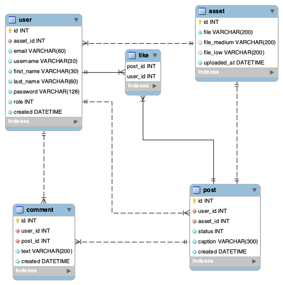

# Friends Gallery

It is the backend for the app Friends Gallery, system when married friends will post photographs to celebrate the moment.

## Technologies

* Python
* Django REST Framework
* PostgreSQL
* Deploy with SSH
* AWS/S3

This API are developed with Django REST Framework with access to PostgreSQL database. You can see the API endpoints importing the file [enpoints.json](./endpoints.json) in the software [Insomnia](https://insomnia.rest/). Also you can see the Entity Relashionship Diagram here:



To run this API in your host, do you need install the PostgreSQL, you can do it with the follow commands:

## Clone the repository
```bash
git clone https://github.com/mateus-oliveira/friends-gallery-api.git
cd friends-gallery-api/
``` 

## Database setup

Install the PostgreSQL and the Python PIP with the commands in your terminal
```bash
sudo apt update
sudo apt install python3-pip python3-dev libpq-dev postgresql postgresql-contrib
sudo -u postgres psql
```

Then, create the database enter  the PostgreSQL terminal:
```bash
CREATE DATABASE gallery;
CREATE USER gallery_user WITH PASSWORD 'gallery_password';
ALTER ROLE gallery_user SET client_encoding TO 'utf8';
ALTER ROLE gallery_user SET default_transaction_isolation TO 'read committed';
ALTER ROLE gallery_user SET timezone TO 'UTC';
GRANT ALL PRIVILEGES ON DATABASE gallery TO gallery_user;
```

After create your database and user, copy the values in  [.env](./src/.env.example) file at the src folder:

```python
DB_NAME=gallery
DB_USER=gallery_user
DB_PASSWORD=gallery_password
DB_HOST=localhost # Or your specified host
DB_PORT=5432 # Or your specified port
```

## Virtual environment setup

Right now, do you need to install the virtual environment to donwload the Python requirements for this app. In your terminal, put the commands below:

```bash
mkdir ~/venv
pip install virtualenv
virtualenv ~/venv/gallery
source ~/venv/gallery/bin/activate
pip install -r requirements.txt
```

## Amazon S3 setup

To upload files, you need configure your credentials for access the Amazon S3, because the files go there. You can do it following this [tutorial](https://docs.aws.amazon.com/IAM/latest/UserGuide/id_users_create.html) or other if you prefer.

When you finished that and obtained your AWS API Key and AWS API ID, do you need create the S3 bucket [here](https://s3.console.aws.amazon.com/). Then, after this, you finally can put the credentials and the bucket name on the [.env](./src/.env.example) file:
```python
AWS_ACCESS_KEY_ID="< your_aws_access_id >"
AWS_SECRET_ACCESS_KEY="< your_aws_access_aws >"
AWS_STORAGE_BUCKET_NAME="< your_s3_bucket_name >"
AWS_DEFAULT_REGION="< your_bucket_default_region >"
```

## Running the API
```bash
python manage.py migrate
python manage.py collectstatic
python manage.py runserver
```

Finally, go to url [http://127.0.0.1:8000/](http://127.0.0.1:8000/) and access the application routes.